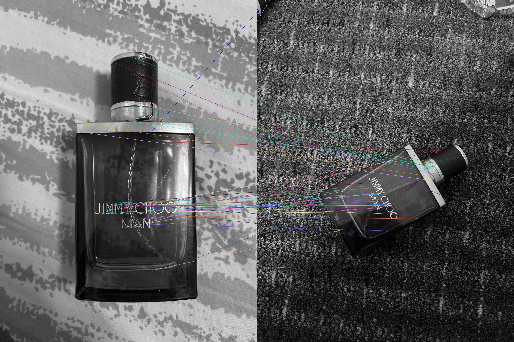
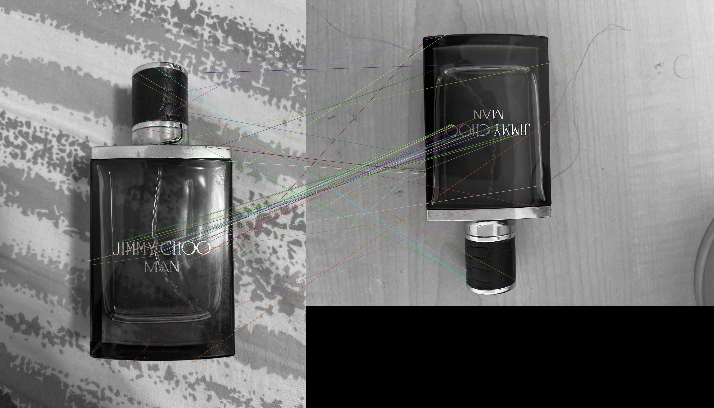
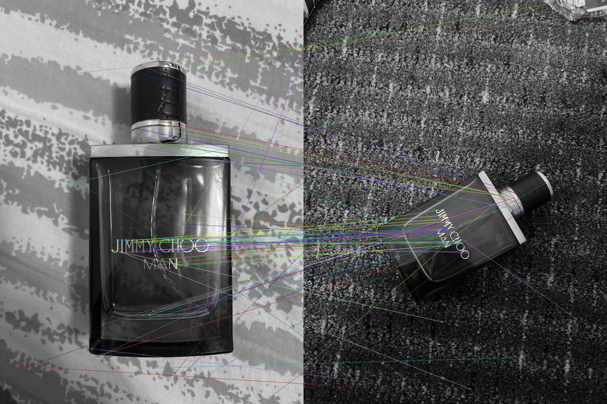
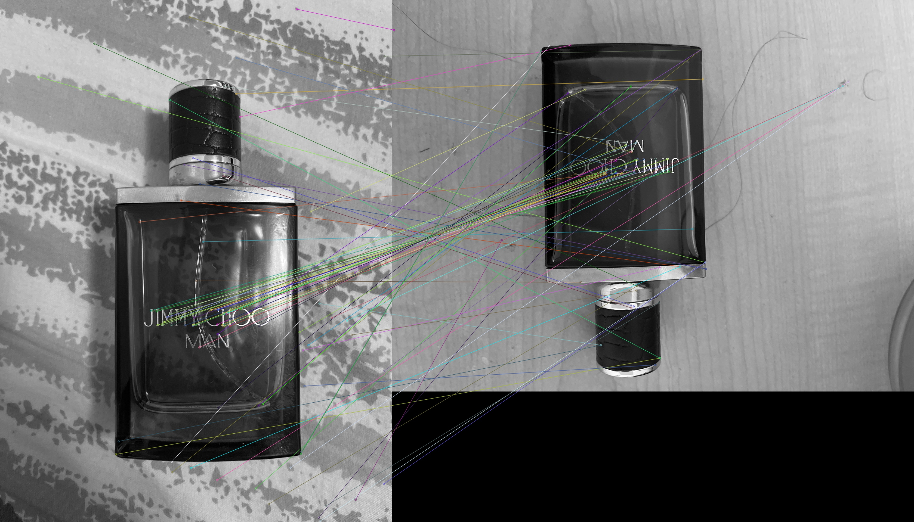
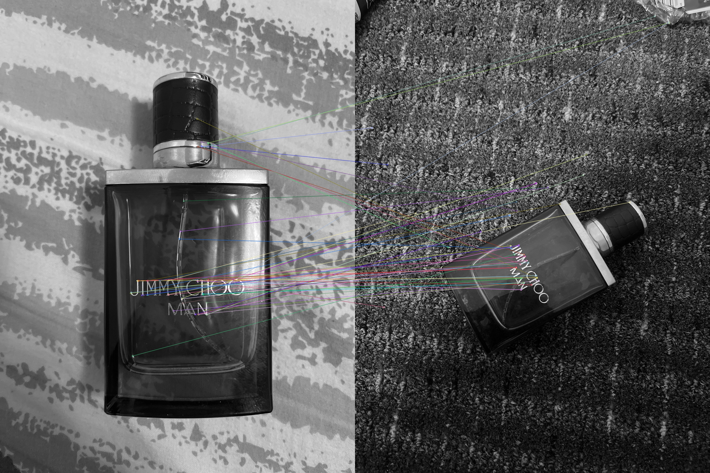
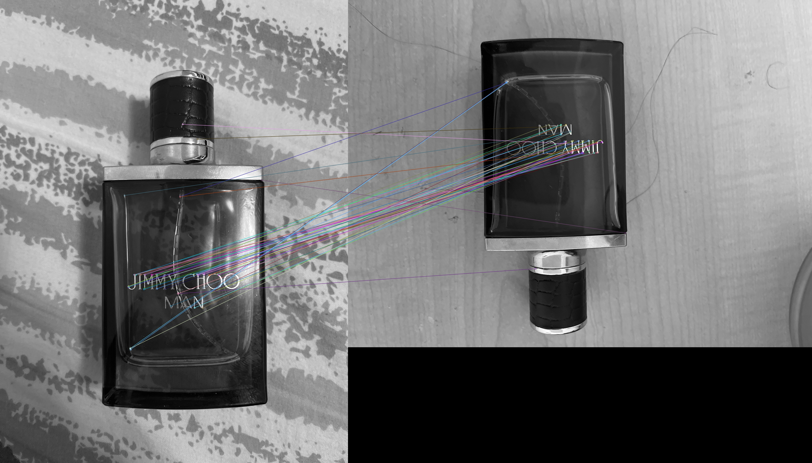
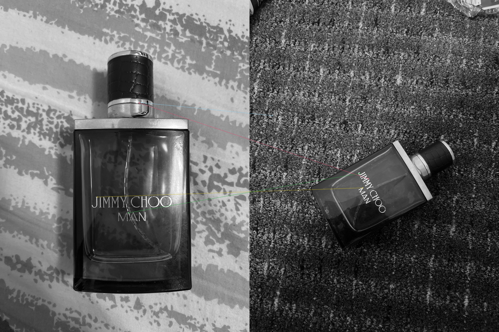
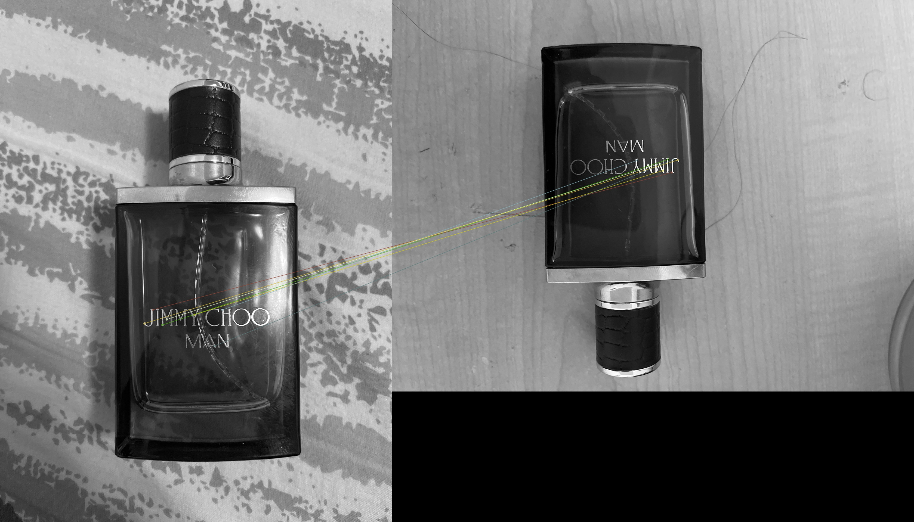

# 🔍 Feature Detection and Matching for Object Detection

This project implements object detection using various feature detection and matching algorithms in OpenCV. A selected object was photographed in different environments, and six combinations of feature detection and matching methods were applied to identify the object across images.

## 🧠 Methods Used

### Feature Detectors:
- SIFT (Scale-Invariant Feature Transform)
- ORB (Oriented FAST and Rotated BRIEF)
- FAST + BRIEF

### Matchers:
- Brute Force Matcher (BFMatcher)
- FLANN-Based Matcher

Each detector was paired with both matchers, resulting in 6 detection pipelines.

## 🧪 Object Detection Workflow
1. Selected a distinct object and captured 3 images in varying settings.
2. Chose one image as the "master" and matched it against the other two.
3. For each feature detector:
   - Applied both BFMatcher and FLANN
   - Plotted feature matches
4. Generated 12 output images (3 detectors × 2 matchers × 2 comparisons)

## 📊 Results Summary

### 📸 Feature Matching Results

We used `Image.png` as the **master image**, and matched it with `Test01.png` and `Test02.png` using 3 different feature detectors, each paired with 2 matchers.

#### 🔹 SIFT Matches
| Test Image 1 (`Test01.png`) | Test Image 2 (`Test02.png`) |
|-----------------------------|------------------------------|
| <br>**SIFT + BF Matcher** | <br>**SIFT + BF Matcher** |
| <br>**SIFT + FLANN Matcher** | <br>**SIFT + FLANN Matcher** |

#### 🔹 ORB Matches
| Test Image 1 (`Test01.png`) | Test Image 2 (`Test02.png`) |
|-----------------------------|------------------------------|
| <br>**ORB + BF Matcher** | <br>**ORB + BF Matcher** |
| <br>**ORB + FLANN Matcher** | <br>**ORB + FLANN Matcher** |

#### 🔹 FAST + BRIEF Matches
| Test Image 1 (`Test01.png`) | Test Image 2 (`Test02.png`) |
|-----------------------------|------------------------------|
| <br>**FAST+BRIEF + BF Matcher** | <br>**FAST+BRIEF + BF Matcher** |
| <br>**FAST+BRIEF + FLANN Matcher** | <br>**FAST+BRIEF + FLANN Matcher** |

---


### ✅ What Worked Well:
- **SIFT** offered the most accurate and robust detection, especially under scaling and rotation.
- **ORB** was significantly faster and effective with proper matcher setup.
- **FAST+BRIEF** was very efficient on simpler images.
- **FLANN** outperformed BFMatcher in speed when more features were involved.

### ❌ What Didn’t Work Well:
- **FAST+BRIEF** struggled with rotation and scaling.
- **ORB** faced challenges on scaled images.
- **FLANN + binary descriptors** required careful tuning and conversion steps.

## 🏁 Conclusion

SIFT with FLANN matching is ideal for high accuracy but comes with a performance cost. ORB offers a good trade-off between speed and accuracy. FAST+BRIEF is suitable for quick but basic detection tasks.

## 📁 Files Included
- `Ass5_Cs455.py` – Source code implementing feature detection and matching
- `Object Detection.docx` – Report detailing observations and comparison
- `output_images/` – 12 annotated images with detected matches

## 🔧 Requirements
- Python 3.x
- OpenCV (`cv2`)
- NumPy
- Matplotlib (for optional visualization)

## 📌 Usage
To run the project:
```bash
python Ass5_Cs455.py


© 2025 Lalith Aditya Chunduri. All rights reserved.

